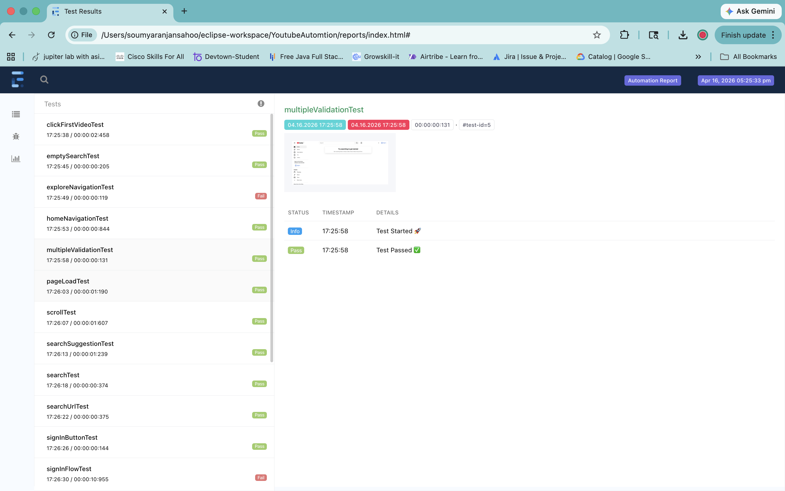
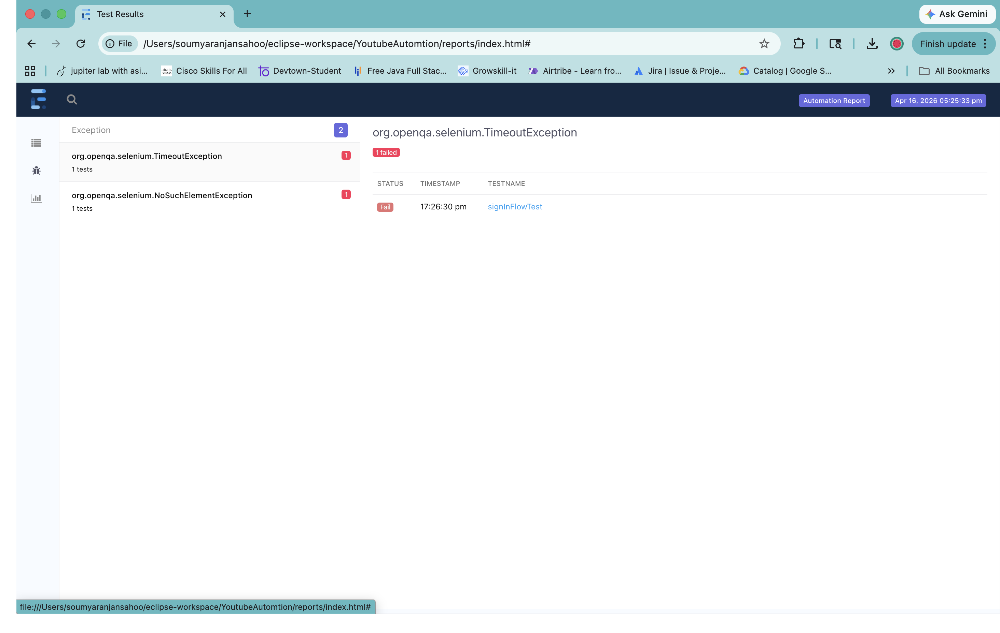
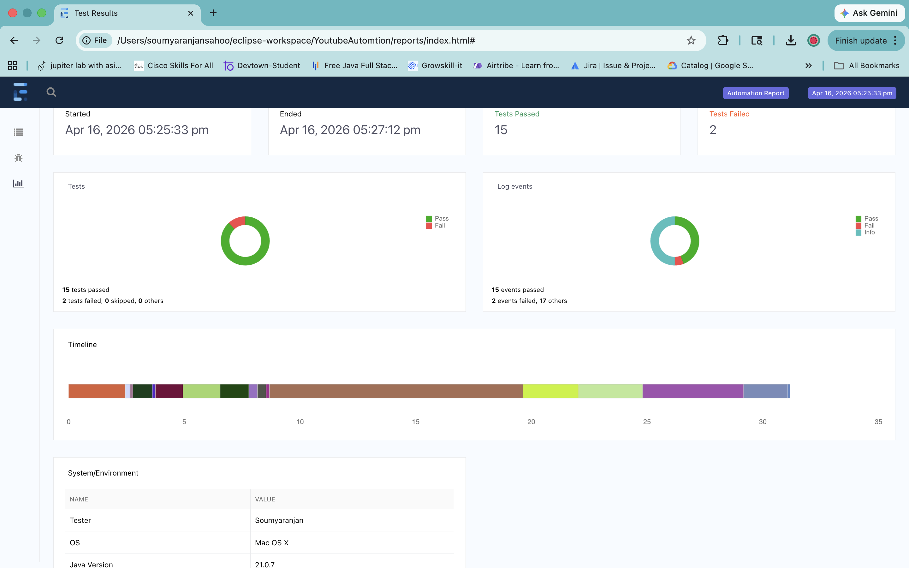

# 🚀 YouTube Web Application - Automation Testing Framework (Selenium + Java)


---

## 👨‍💻 About This Repository

This repository contains a **Selenium Automation Testing Framework** built using Java, TestNG, and Maven.

It demonstrates:

* ✅ End-to-End Automation Testing
* ✅ Page Object Model (POM) Framework
* ✅ Cross-Browser Testing
* ✅ Real-time Test Execution & Reporting

This project reflects **hands-on experience in UI Automation Testing**, making it suitable for **QA Engineer / SDET roles**.

🔗 **GitHub Repo:**
https://github.com/soumyaranjansahoo5/youtube-automation-testing-selenium

---

## 🚀 Tech Stack

* Selenium WebDriver
* Java
* TestNG
* Maven
* WebDriverManager

---

## 🧪 Key Highlights

* Automated **120+ test cases** across 8 modules
* Implemented **Page Object Model (POM)** design pattern
* Used **TestNG** for execution, grouping, and reporting
* Performed **cross-browser testing** (Chrome, Firefox, Edge)
* Integrated **Maven** for dependency management
* Generated **TestNG HTML reports**

---

## 🏗️ Framework Architecture

* `base/` → WebDriver setup
* `pages/` → Page Object classes
* `testcases/` → Test execution logic
* `utils/` → Reusable utilities

---

## 🔍 QA Coverage

* Functional Testing
* Regression Testing
* Smoke Testing
* Cross-Browser Testing
* UI Validation
* Test Case Design

---

## 📊 Test Coverage

* Login functionality
* Search functionality
* Video playback validation
* Navigation flows
* UI validation

---

## ⚙️ TestNG Configuration

The `testng.xml` file is used to:

* Define test suites
* Control execution flow
* Enable parallel execution
* Group test cases

---

## 📸 Test Execution Report

### 🔹 Selenium Test Execution Result (Maven Build - SUCCESS)

* **Total Tests Executed:** 17
* ✅ **Passed:** 15
* ❌ **Failed:** 2
* ⏱ **Execution Time:** ~2 minutes

---

### 🔹 Summary Report



---

### 🔹 Detailed Report



---

### 🔹 Exception Report



---

### 🔹 Execution Output


---

## ▶️ How to Run

### 1️⃣ Clone the repository

```bash
git clone https://github.com/soumyaranjansahoo5/youtube-automation-testing-selenium.git
```

### 2️⃣ Navigate to project folder

```bash
cd youtube-automation-testing-selenium
```

### 3️⃣ Execute tests

```bash
mvn clean test
```

---

## 📈 Reports

TestNG HTML reports are generated in:

```
/test-output/index.html
```

---

## 🚀 Future Enhancements

* CI/CD integration with Jenkins
* Selenium Grid for parallel execution
* Docker-based execution
* Cloud testing (BrowserStack / Sauce Labs)

---

## 👨‍💻 Author

**Soumyaranjan Sahoo**

🔗 LinkedIn: https://www.linkedin.com/in/soumyaranjan7321/
🔗 GitHub: https://github.com/soumyaranjansahoo5
